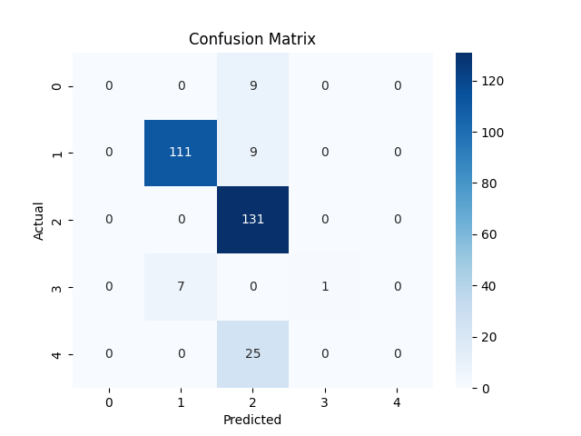

# Result Report

**Name**: Serika Kawano
**Date**: 2025-05-17 13:45 JST

The following classification experiments were performed on the test set using the `weather_forecast.py` script:

* **Models**: Logistic Regression, Random Forest Classifier
* **Original dataset size**: 1462 samples
* **Test set size**: 293 samples
* **Class distribution in the test set**:

  * drizzle (0): 9 samples
  * rain (1): 120 samples
  * sun (2): 131 samples
  * snow (3): 8 samples
  * fog (4): 25 samples

## Overall Accuracy

* **Accuracy**: 0.83 (82.94%)

## Detailed Classification Report

| Weather Category     | Label | Precision | Recall   | F1-score | Support |
| -------------------- | ----- | --------- | -------- | -------- | ------- |
| drizzle              | 0     | 0.00      | 0.00     | 0.00     | 9       |
| rain                 | 1     | 0.94      | 0.93     | 0.93     | 120     |
| sun                  | 2     | 0.75      | 1.00     | 0.86     | 131     |
| snow                 | 3     | 1.00      | 0.12     | 0.22     | 8       |
| fog                  | 4     | 0.00      | 0.00     | 0.00     | 25      |
| **Macro average**    |       | **0.54**  | **0.41** | **0.40** | 293     |
| **Weighted average** |       | **0.75**  | **0.83** | **0.77** | 293     |

## Confusion Matrix

Below is the normalised confusion matrix generated for each class:

## Discussion

The model achieves an overall accuracy of **82.9%**, indicating it correctly predicts the weather class in the majority of cases. However, performance varies substantially across classes:

* **Rain (class 1)**: Excellent performance (precision 0.94, recall 0.93), reflecting the abundant rain examples in training.
* **Sun (class 2)**: Strong recall (1.00) but moderate precision (0.75), meaning most sunny days are detected, though a portion of predictions are misclassified from other classes.
* **Snow (class 3)**: Perfect precision (1.00) but very low recall (0.12), which suggests the model is highly conservative about predicting snow and fails to identify most snowy days.
* **Drizzle (class 0) and Fog (class 4)**: Both classes have zero precision and recall, indicating the model never predicts these classes in the test set.

These patterns point to a strong class imbalance (few drizzle, snow, and fog samples) that the current model does not handle well. To improve:

1. **Resampling**: Apply oversampling (e.g., SMOTE) for under‑represented classes or undersample the majority class to balance the dataset.
2. **Class weighting**: Use `class_weight='balanced'` in both LogisticRegression and RandomForestClassifier to penalise misclassification of minority classes.
3. **Feature enhancement**: Engineer additional features (e.g., rolling window statistics, humidity if available) to help distinguish drizzly and foggy conditions.

By addressing imbalance and enriching the feature set, I can expect more reliable predictions for all weather classes.\*

